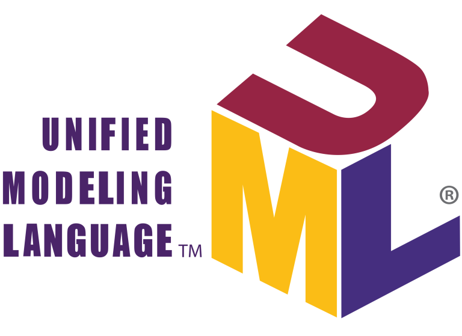
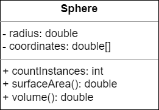
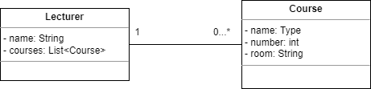
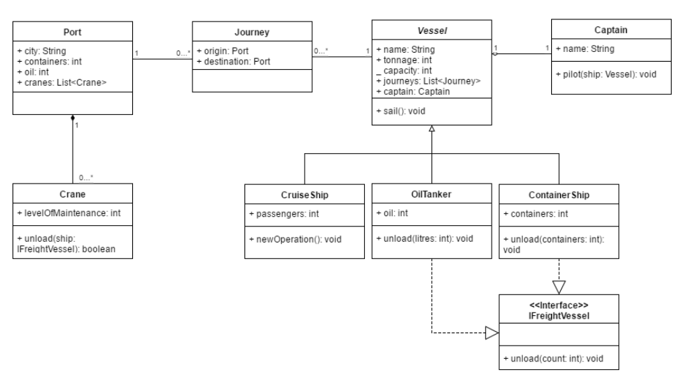

Lab - UML
==========

Before you start
----------
The purpose of this lab is to practice how to creat UML diagram.
For creating and modifying UML diagrams, there are different tools available online. You may use any tool you like to draw diagrams in this course. you can use [Draw.io](https://www.draw.io/​)

You can export the image as a file and put into this project. Then, please use git markup to insert the diagram's image below each exercise in this Reademe file such as 

```

```
 where logo.png is located in image folder under this project.


Exercise One - Simple Sphere
--------------------
Using either pen & paper or the diagramming tool of your choice, create a simple UML class
diagram showing a Sphere class. A sphere has the following attributes:
- A radius
- A three-element array for the Cartesian coordinates of the sphere (centroid)

The sphere is initialised by setting the radius and the coordinates of the sphere. The sphere class also has the following features:

- Returns the count of all instances of spheres
- Returns the surface area of a sphere (Surface Area=4πr​ 2​ )
- Returns the volume of a sphere (Volume=4/3 πr​ 3​ )

**Put your class diagram below.**



Exercise Two: Class Associations & Multiplicities
-----------------------------
Create a simple class diagram, with associations and multiplicities, for the following
scenarios:
1. Lecturers teach ​ Courses ​ . Each lecturer has a name, and a list of courses they are
teaching, which can be zero or more. Each course has a name, a course number,
and a room. A course must be taught by exactly one lecturer.
2. Libraries have ​ Books ​ . Each library has a name, location, and a list of books. The
library has ​ more than 1000 books. Each book has a name, a genre, and the library it
belongs to. Each book belongs to exactly one library.

**Put your class diagram below.**




Exercise Three: Understanding UML Diagrams
------------------------------



With the UML diagram above, please answer the questions below:
1. What classes have an association relationship?
2. What classes have an aggregation relationship?
3. What classes have a composition relationship?
4. Which classes implement an interface?
5. Which classes are subclasses of another class?
6. What attributes does the OilTanker class have?
7. What is the multiplicity between Port and Journey?
8. What reference types can be used to refer to a ContainerShip object?


```
1. Port - Journey, Journey - Vessel.
2. Vessel <- Caption.
3. Port <- Crane.
4. OilTanker, ContainerShip.
5. CruiseShip, OilTanker, ContainerShip.
6. Attributes variable : name, tonnage, capacity, journeys, captain, oil. Attributes method : sail(), unload().
7. Port can have zero or more Journeys, and Journey can have exactly one Port.
8. IFreight, Vessel, ContainerShip.
```

Submit this lab
------------------
:octocat: Don't forget to push your project to Github. 

